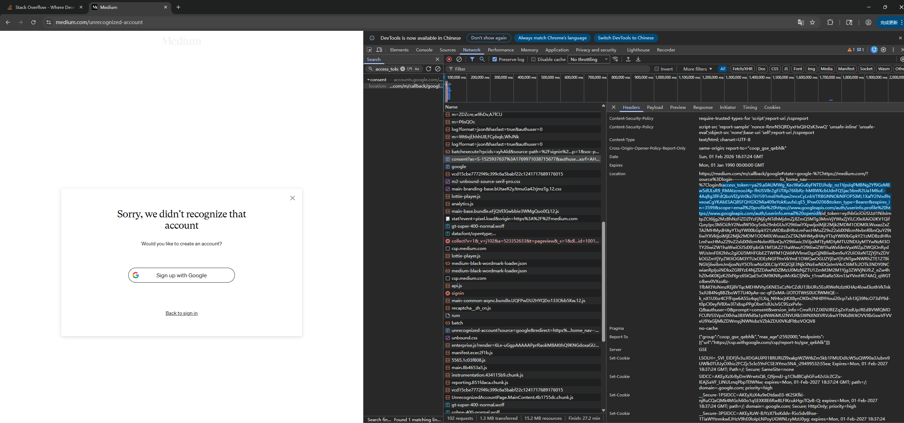
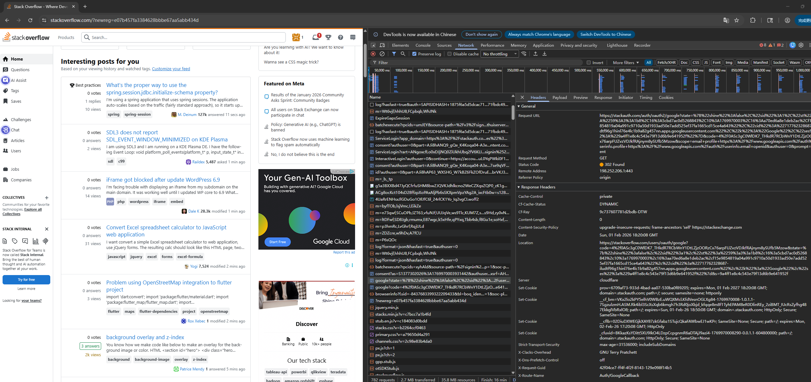

## 2. Explain TLS, PKI, Certificate, Public Key, Private Key, Signature

- ### TLS (Transport Layer Security)
  - Encrypts data between client and server, ensuring confidentiality, integrity, and authenticity.

- ### PKI (Public Key Infrastructure)
  - A system that manages certificates, keys, and trust relationships.

- ### Certificate
  - A digital document that binds a public key to an identity, signed by a Certificate Authority (CA).

- ### Public Key
  - Shared openly; used to encrypt data or verify signatures.

- ### Private Key
  - Kept secret; used to decrypt data or create digital signatures.

- ### Digital Signature
  - Created using a private key; verified using the corresponding public key to ensure authenticity and integrity.

---

## 3. Spring security based application
- ### Can you verify HTTPS without importing the certificate?
  - No. The self-signed certificate is not signed by any Certificate Authority (CA) in the client's trust store. When Postman (or curl, or a browser) connects to https://localhost:8443, it receives the server's           
  certificate and tries to walk the certificate chain up to a trusted root CA. Since this cert is self-signed, there is no chain — the issuer is itself, and it's not in the client's trusted CA list. The TLS handshake   
  fails with a "certificate not trusted" error.
                                                                                                                                                                                                                            
- ### How to make HTTPS work without bypassing TLS verification
  - The proper approach is to add the self-signed certificate to the client's trusted CA certificates: 
  - In Postman:
    - Go to Settings → Certificates → CA Certificates.
    - Toggle it ON and select the file src/main/resources/security-demo.crt 
    - Now GET https://localhost:8443/api/auth will succeed with SSL verification enabled 
  - With curl:
    - curl --cacert src/main/resources/security-demo.crt https://localhost:8443/api/auth

---

## 4. HTTP Status Codes Related to Authentication & Authorization

- **401 Unauthorized** – Authentication required or failed
- **403 Forbidden** – Authenticated but not authorized
- **400 Bad Request** – Malformed auth request
- **407 Proxy Authentication Required**
- **419 Authentication Timeout** (non-standard)
- **429 Too Many Requests** (rate limiting)

---

## 5. Authentication vs Authorization & Spring Security Components

### Authentication
Verifies **who you are**

### Authorization
Determines **what you can access**

### Important Spring Security Components
- **AuthenticationFilter** – Intercepts login requests
- **AuthenticationManager** – Coordinates authentication
- **AuthenticationProvider** – Performs authentication logic
- **UserDetailsService** – Loads user data
- **SecurityContext** – Stores authentication state
- **AccessDecisionManager** – Makes authorization decisions

---

## 6. HTTP Session

An HTTP Session stores user state on the **server side** across multiple requests using a session ID.

Used for:
- Login state
- User preferences
- Temporary data

---

## 7. Cookie

A cookie is small data stored on the **client side** and sent with each HTTP request.

Used for:
- Session IDs
- Preferences
- Tracking

---

## 8. Session vs Cookie

| Aspect | Session | Cookie |
|-----|------|------|
| Storage | Server-side | Client-side |
| Security | More secure | Less secure |
| Size | Large | Limited (~4KB) |
| Scalability | Harder | Easier |
| Persistence | Until expired | Can persist |

---

## 9. Google SSO (Single Sign-On)

Examples of websites supporting Google login:
- Medium

- Stack Overflow

### How Google SSO Works

1. User clicks “Login with Google”
2. Website redirects user to Google OAuth server
3. User authenticates with Google
4. Google returns an **authorization code** (or **access_token**)
5. Website exchanges code for tokens
6. User session is established

SSO-related REST calls can be observed in browser DevTools:
- `/o/oauth2/v2/auth`
- `/token`
- `/userinfo`

---

## 10. Using Session and Cookie to Keep User Info

- Cookie stores the **session ID**
- Server maps session ID to user data
- Each request includes the cookie
- Server retrieves session state

---

## 11. Spring Security Filter

Spring Security Filter is a chain of filters that:
- Intercepts HTTP requests
- Handles authentication
- Enforces authorization
- Protects against attacks (CSRF, XSS)

---

## 12. Bearer Token & JWT

### Bearer Token
A token presented by the client to access protected resources.

### JWT (JSON Web Token)
- Stateless
- Digitally signed
- Contains claims (user ID, roles, expiry)

Flow:
1. Login
2. Receive JWT
3. Send JWT in `Authorization: Bearer` header

---

## 13. Storing Sensitive Information in DB

### Passwords
- Never store plaintext
- Use hashing (bcrypt, Argon2)
- Add salt

### Credit Card Numbers
- Encrypt at rest
- Tokenize when possible
- Follow PCI-DSS standards

---

## 14. UserDetailsService vs Authentication Components

- **UserDetailsService** – Loads user data
- **AuthenticationProvider** – Validates credentials
- **AuthenticationManager** – Orchestrates authentication
- **AuthenticationFilter** – Extracts credentials from requests

---

## 15. Disadvantages of Session & How to Overcome

### Disadvantages
- Server memory usage
- Hard to scale horizontally
- Sticky sessions required

### Solutions
- JWT (stateless)
- Distributed cache (Redis)
- Short-lived sessions

---

## 16. Getting Values from application.properties

Values are accessed via:
- `@Value`
- `Environment`
- `@ConfigurationProperties`

Used for:
- Secrets
- URLs
- Feature flags

---

## 17. Role of configure(HttpSecurity) and configure(AuthenticationManagerBuilder)

- **HttpSecurity**
    - URL security
    - HTTPS enforcement
    - CSRF
    - Authorization rules

- **AuthenticationManagerBuilder**
    - User sources
    - Password encoders
    - Authentication providers

---

## 19. Best Practices for Storing Secrets

- Never hardcode secrets
- Use environment variables
- Use secret managers (Vault, AWS Secrets Manager)
- Rotate keys regularly
- Restrict access by role
- Encrypt secrets at rest and in transit

