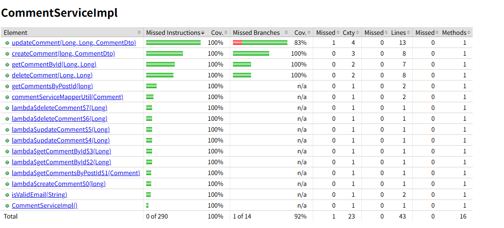

## Part 1 — Testing Related Concepts

### 1. Unit Testing

**Definition:**
Testing the smallest isolated piece of logic (a function or class) independently from the rest of the system.

**Goal:** Verify correctness of business logic.

**Who runs it:** Developers

**Example:**
Testing a `calculateDiscount(price, userType)` function to ensure VIP users receive 20% off.

---

### 2. Functional Testing

**Definition:**
Testing whether a feature behaves according to the product requirements/specification.

**Goal:** Validate behavior from a feature perspective, not internal code structure.

**Who runs it:** QA / automation testers

**Example:**
User logs in → adds item to cart → checkout succeeds.

---

### 3. Integration Testing

**Definition:**
Testing interaction between multiple modules or services.

**Goal:** Ensure components communicate correctly.

**Who runs it:** Developers + QA

**Example:**
Order Service calls Payment Service and updates database successfully.

---

### 4. Regression Testing

**Definition:**
Re-running previous tests to ensure new changes didn’t break existing functionality.

**Goal:** Prevent old bugs from returning.

**Who runs it:** Automated CI pipelines / QA

**Example:**
After adding coupon feature, verify login, checkout, and payment still work.

---

### 5. Smoke Testing

**Definition:**
A quick, shallow test verifying the system is stable enough for deeper testing.

**Goal:** Detect catastrophic failures early.

**Who runs it:** CI pipeline / QA

**Example:**
Server starts, homepage loads, login endpoint responds 200 OK.

---

### 6. Performance Testing

**Definition:**
Measures responsiveness and throughput under expected load.

**Goal:** Verify system meets latency and throughput targets.

**Example:**
1000 users placing orders simultaneously → response time < 200ms.

---

### 7. Stress Testing

**Definition:**
Push system beyond normal limits until failure occurs.

**Goal:** Find breaking point and recovery behavior.

**Example:**
Increase traffic from 1k → 50k requests/sec until service crashes.

---

### 8. A/B Testing

**Definition:**
Release two variants to different user groups to compare real-world behavior.

**Goal:** Product decision optimization, not correctness.

**Example:**
50% users see blue checkout button, 50% see green → compare conversion rate.

---

### 9. End-to-End (E2E) Testing

**Definition:**
Test the entire workflow across all systems as a real user would.

**Goal:** Validate full user journey.

**Example:**
User registers → verifies email → logs in → purchases item → receives confirmation email.

---

### 10. User Acceptance Testing (UAT)

**Definition:**
Testing performed by stakeholders or customers to confirm system meets business needs.

**Goal:** Business approval before release.

**Example:**
Finance department verifies tax calculations match legal rules.

---

## Testing Comparison Summary

| Test Type   | Scope                 | Main Purpose           | Typical Owner |
| ----------- | --------------------- | ---------------------- | ------------- |
| Unit        | Single function       | Logic correctness      | Developer     |
| Integration | Multiple components   | Interface correctness  | Dev + QA      |
| Functional  | Feature behavior      | Requirement validation | QA            |
| Regression  | Whole system          | Prevent breakage       | CI / QA       |
| Smoke       | Minimal critical path | Build stability        | CI            |
| Performance | Normal load           | Speed & scalability    | QA / SRE      |
| Stress      | Extreme load          | Failure limits         | SRE           |
| A/B         | Real users            | Product decision       | Product       |
| E2E         | Full workflow         | System correctness     | QA            |
| UAT         | Business workflows    | Stakeholder approval   | Customers     |

---

## Part 2 — Environment Related Concepts

### 1. Development Environment (Dev)

**Purpose:** Local coding and debugging.

**Characteristics:**

* Runs on developer machines
* Mocked services or local databases
* Frequent changes, unstable

**Example:** Running Spring Boot locally with an in-memory database.

---

### 2. QA Environment

**Purpose:** Dedicated environment for testers to verify functionality.

**Characteristics:**

* Shared by QA team
* Stable test data
* Automated test suites run here

**Example:** QA server with test payment gateway sandbox.

---

### 3. Pre-production / Staging Environment

**Purpose:** Mirror production as closely as possible before release.

**Characteristics:**

* Same infrastructure as production
* Realistic scale & configs
* Final verification before launch

**Example:** Same Kubernetes cluster configuration and database type as production but isolated data.

---

### 4. Production Environment (Prod)

**Purpose:** Live system used by real customers.

**Characteristics:**

* Real users and real data
* Highest reliability requirements
* Strict monitoring & rollback

**Example:** Public website customers use daily.

---

## Environment Comparison

| Environment | Stability         | Data            | Who Uses     | Risk Level |
| ----------- | ----------------- | --------------- | ------------ | ---------- |
| Dev         | Very unstable     | Fake/mock       | Developers   | None       |
| QA          | Moderately stable | Test data       | QA           | Low        |
| Staging     | Highly stable     | Production-like | QA + Product | Medium     |
| Production  | Fully stable      | Real user data  | Customers    | Critical   |

---

## Typical Release Flow

Dev → QA → Staging → Production

Each step increases realism, risk, and confidence before reaching real users.

-- 
## Part3 Unit test coverage

